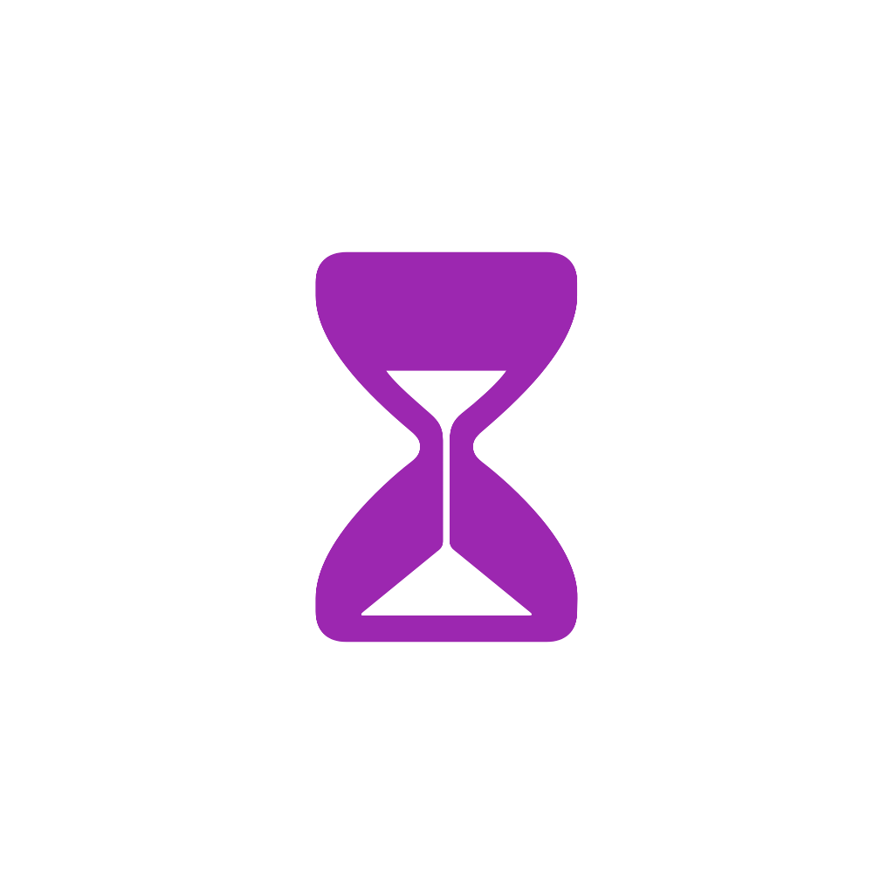

<p align="center">
  
</p>

<p align="center">
<a href="https://www.buymeacoffee.com/ambitionsoftware" target="_blank"></a>
</p>

<h1 align="center"><a href="https://apps.apple.com/ca/app/foqos/id6736793117">Foqos</a></h1>

<p align="center">
  <strong>Focus, the physical way</strong>
</p>

<p align="center">
  Foqos helps you put your most distracting apps behind a quick tap — using NFC tags or QR codes — so you can stay in the zone and build better digital habits. It’s free, open source, and an alternative to Brick, Bloom, Unpluq, Blok, and more.
</p>

---

## ✨ Features

- **🏷️ NFC & QR Blocking**: Start or stop sessions with a quick tag tap or QR scan
- **🧩 Mix & Match Strategies**: Manual, NFC, QR, NFC + Manual, QR + Manual, NFC + Timer, QR + Timer
- **⏱️ Timer-Based Blocking**: Block for a set duration, then unblock with NFC or QR
- **🔐 Physical Unblock**: Optionally require a specific tag or code to stop
- **📱 Profiles for Life**: Create profiles for work, study, sleep — whatever you need
- **📊 Habit Tracking**: See your focus streaks and session history at a glance
- **⏸️ Smart Breaks**: Take a breather without stopping your session
- **🌐 Website Blocking**: Block distracting websites in addition to apps
- **🔄 Live Activities**: Real-time status on your Lock Screen

## 📋 Requirements

- iOS 17.6+
- iPhone with NFC capability (for NFC features)
- Screen Time permissions (for app blocking)

## 🚀 Getting Started

### From the App Store

1. Download Foqos from the [App Store](https://apps.apple.com/ca/app/foqos/id6736793117)
2. Grant Screen Time permissions when prompted
3. Create your first blocking profile
4. Optionally set up NFC tags or a QR code and start focusing

### Setting Up NFC Tags

1. Grab a few NFC tags (NTAG213 or similar works great)
2. Create a profile in Foqos
3. Write the tag from within the app
4. Stick tags where they make sense (desk, study spot, bedside)
5. Tap to start or stop a session

### Setting Up Shortcuts

Automate triggering Foqos profiles with iOS Shortcuts. Note that you'll need to create separate automations for each NFC tag.

1. Open the **Shortcuts** app and go to the **Automation** tab.  
2. Tap **Create Personal Automation** and search for **NFC**.  
3. Scan an NFC tag and give it a name for the Foqos profile you want to run.  
4. Enable **Run Immediately** and turn on **Notify When Run**. Tap **Next**.  


5. Create a New Blank Automation. Search for 'Foqos' and add **Check if Foqos Session is Active**. Turn off **Show When Run**.  


6. Add an **If** block with **Start Foqos Profile** and **Stop Foqos Profile**. For the Start and Stop actions, tap on the variable name, clear it, then select the Foqos profile you wish to trigger.  
7. Arrange the actions so the profile is stopped if active; otherwise, it starts.  

  


### 3D Printable NFC Accessories

Enhance your Foqos setup with a 3D printable brick or keychain, compatible with 25mm NFC tags:

- [Foqos NFC Brick & Keychain on Printables](https://www.printables.com/model/1537982-foqos-nfc-brick-keychain)


## 🛠️ Development

### Prerequisites

- Xcode 15.0+
- iOS 17.0+ SDK
- Swift 5.9+
- Apple Developer Account (for Screen Time and NFC entitlements)

### Building the Project

```bash
git clone https://github.com/awaseem/foqos.git
cd foqos
open foqos.xcodeproj
```

### Project Structure

```
foqos/
├── Foqos/                     # Main app target
│   ├── Views/                 # SwiftUI views
│   ├── Models/                # Data models
│   │   └── Strategies/        # Blocking strategies
│   ├── Components/            # Reusable UI components
│   ├── Utils/                 # Utility functions
│   └── Intents/               # App Intents & Shortcuts
├── FoqosWidget/               # Widget extension
└── FoqosDeviceMonitor/        # Device monitoring extension
```

### Key Technologies Used

- **SwiftUI** — Modern, declarative UI
- **SwiftData** — Local persistence
- **Family Controls** — App blocking
- **Core NFC** — Tag reading/writing
- **CodeScanner** — QR scanning
- **BackgroundTasks** — Background processing
- **Live Activities** — Dynamic Island + Lock Screen updates
- **WidgetKit** — Home Screen widgets
- **App Intents** — Shortcuts and automation

## 🔒 Blocking Strategies

All strategies live in `Foqos/Models/Strategies/` and are orchestrated by `Foqos/Utils/StrategyManager.swift`.

- **NFC Tags (`NFCBlockingStrategy`)**

  - Start: scan any NFC tag to start the selected profile
  - Stop: scan the same tag to stop the session
  - **Physical Unblock (optional)**: set `physicalUnblockNFCTagId` on a profile to require that exact tag to stop (ignores the session's start tag)

- **QR Codes (`QRCodeBlockingStrategy`)**

  - Start: scan any QR code to start the selected profile
  - Stop: scan the same QR code to stop the session
  - **Physical Unblock (optional)**: set `physicalUnblockQRCodeId` on a profile to require that exact code to stop (ignores the session's start code)
  - The app can display/share a QR representing the profile's deep link using `QRCodeView`

- **Manual (`ManualBlockingStrategy`)**

  - Start/Stop entirely from within the app (no external tag/code required)

- **NFC + Manual (`NFCManualBlockingStrategy`)**

  - Start: manually from within the app
  - Stop: scan any NFC tag (restricted to `physicalUnblockNFCTagId` if set)

- **QR + Manual (`QRManualBlockingStrategy`)**

  - Start: manually from within the app
  - Stop: scan any QR code (restricted to `physicalUnblockQRCodeId` if set)

- **NFC + Timer (`NFCTimerBlockingStrategy`)** ⏱️

  - Start: select a duration (timer) from within the app
  - Stop: scan any NFC tag to end early (restricted to `physicalUnblockNFCTagId` if set)
  - Perfect for time-boxed focus sessions with a physical exit mechanism

- **QR + Timer (`QRTimerBlockingStrategy`)** ⏱️

  - Start: select a duration (timer) from within the app
  - Stop: scan any QR code to end early (restricted to `physicalUnblockQRCodeId` if set)
  - Perfect for time-boxed focus sessions with a physical exit mechanism

### QR deep links

- Each profile exposes a deep link via `BlockedProfiles.getProfileDeepLink(profile)` in the form:
  - `https://foqos.app/profile/<PROFILE_UUID>`
- Scanning a QR that encodes this deep link will toggle the profile: if inactive it starts, if active it stops. This works even if the app isn’t already open (it will be launched via the link).

## 🤝 Contributing

We love contributions! Here’s how to jump in:

1. **Fork the repository**
2. **Make your changes** and test them out
3. **Commit your changes** (`git commit -m 'Add amazing feature'`)
4. **Open a Pull Request**

### Contribution Guidelines

- Follow Swift coding conventions
- Update documentation as needed
- Test on multiple iOS versions when possible

## 🐛 Issues & Support

Something not working as expected? We're here to help.

- **Bug Reports**: [Open an issue](https://github.com/awaseem/foqos/issues) with detailed steps to reproduce
- **Feature Requests**: Share your ideas via [GitHub Issues](https://github.com/awaseem/foqos/issues)
- **Questions**: Use GitHub Discussions for general questions

When reporting issues, please include:

- iOS version
- Device model
- Steps to reproduce
- Expected vs actual behavior
- Screenshots if applicable
- **Debug output** (needed for diagnosing issues):
  1. Start an active profile
  2. Scroll to the bottom and tap "Debug Mode"
  3. Tap the copy button on the right-hand side
  4. Paste the output in your issue report

## 📄 License

This project is licensed under the MIT License - see the [LICENSE](LICENSE) file for details.

## 🔗 Links

- [App Store](https://apps.apple.com/ca/app/foqos/id6736793117)
- [GitHub Issues](https://github.com/awaseem/foqos/issues)
- [Support the Project](https://apps.apple.com/ca/app/foqos/id6736793117) (via in-app purchases or [here](https://coff.ee/ambitionsoftware))

---

<p align="center">
  Made with ❤️ by <a href="https://github.com/awaseem">Ali Waseem</a>
</p>
