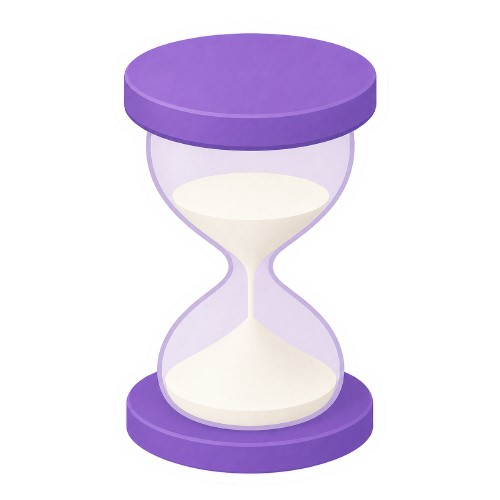

<p align="center">
  
</p>

<h1 align="center"><a href="https://apps.apple.com/ca/app/foqos/id6736793117">Foqos</a></h1>

<p align="center">
  <strong>Free, open-source iPhone app blocker with NFC and QR code unlocking.</strong>
</p>

<p align="center">
  Foqos is a privacy-first iOS app blocker that uses Apple's Screen Time API to block distracting apps and websites. Start a focus session manually, with an NFC tag, with a QR code or barcode, with a timer, or with temporary access rules. It is built as a free and open-source alternative to Brick, Unpluq, Blok, Opal, and other paid app blockers for iPhone.
</p>

<p align="center">
  <a href="https://www.foqos.app/">Website</a> |
  <a href="https://apps.apple.com/ca/app/foqos/id6736793117">App Store</a> |
  <a href="https://github.com/awaseem/foqos/releases">Releases</a> |
  <a href="https://coff.ee/ambitionsoftware">Support the project</a>
</p>

---

## What Foqos Does

Foqos helps you put friction between yourself and the apps or websites you want to avoid. You create blocking profiles for work, study, bedtime, or any other routine, choose the apps and domains to block, then decide how that profile starts and stops.

Unlike hardware-first blockers, Foqos works with cheap NFC tags, printable QR codes, barcodes, iOS Shortcuts, and in-app controls. Your data stays on your device. There is no account requirement, no tracking, no ads, and no subscription.

## Free Alternative to Brick, Unpluq, Blok, and Opal

Foqos is built for people who want physical app blocking on iPhone without buying a dedicated device or paying for a subscription. It covers the core workflows people often look for in a Brick alternative, Unpluq alternative, Blok alternative, or Opal alternative: app blocking, website blocking, NFC unlocks, QR code unlocks, timed focus sessions, and local privacy.

Foqos is not affiliated with Brick, Unpluq, Blok, or Opal.

## Features

- App and website blocking through Apple's Screen Time APIs
- Custom profiles for different routines, schedules, app groups, and domains
- NFC tag blocking for physical start and stop flows
- QR code and barcode blocking, including generated profile QR codes
- Timer-based sessions that end automatically after a chosen duration
- Physical unlock rules for profiles that should only stop with approved tags or codes
- Temporary Access strategies for limited, short opens without ending the full session
- Pause Timer strategies for a short break before blocking resumes
- Smart breaks, session history, focus streaks, and profile insights
- Live Activities for Lock Screen and Dynamic Island status
- Widgets and App Intents for faster profile control
- Local-first privacy with no cloud sync or analytics

## Blocking Strategies

Foqos includes several ways to start and stop a blocking session. All strategies are implemented in `Foqos/Models/Strategies/` and registered in `Foqos/Utils/StrategyManager.swift`.

| Strategy | Best for | How it works |
| --- | --- | --- |
| `ManualBlockingStrategy` | Simple in-app blocking | Start and stop directly in Foqos. |
| `NFCBlockingStrategy` | Physical NFC app blocking | Scan an NFC tag to start. Scan the same tag again to stop, unless strict unlock rules are configured. |
| `QRCodeBlockingStrategy` | QR code or barcode blocking | Scan a QR code or barcode to start. Scan the same code again to stop, unless strict unlock rules are configured. |
| `NFCManualBlockingStrategy` | Easy start, physical stop | Start in the app. Stop by scanning an NFC tag. |
| `QRManualBlockingStrategy` | Easy start, QR or barcode stop | Start in the app. Stop by scanning a QR code or barcode. |
| `NFCTimerBlockingStrategy` | Timed focus with NFC escape hatch | Choose a duration. Blocking ends when the timer expires, or early when an allowed NFC tag is scanned. |
| `QRTimerBlockingStrategy` | Timed focus with QR or barcode escape hatch | Choose a duration. Blocking ends when the timer expires, or early when an allowed QR code or barcode is scanned. |
| `ShortcutTimerBlockingStrategy` | Manual timer sessions | Choose a duration. Stop early with the in-app Stop button. |
| `NFCPauseTimerBlockingStrategy` | Long sessions with NFC pause control | Choose a pause duration. Scan an NFC tag once to pause, then again during the pause to fully stop. |
| `QRPauseTimerBlockingStrategy` | Long sessions with QR or barcode pause control | Choose a pause duration. Scan a QR code or barcode once to pause, then again during the pause to fully stop. |
| `NFCSoftUnblockBlockingStrategy` | Limited temporary access with NFC stop | Keep blocking active but allow a configured number of short opens. Stop the session with an NFC tag. |
| `QRSoftUnblockBlockingStrategy` | Limited temporary access with QR or barcode stop | Keep blocking active but allow a configured number of short opens. Stop the session with a QR code or barcode. |

Strict unlocks can require specific physical unlock items. When a profile has an approved NFC tag, QR code, or barcode configured, other tags and codes cannot stop that profile.

## How It Works

1. Download Foqos from the [App Store](https://apps.apple.com/ca/app/foqos/id6736793117).
2. Grant Screen Time access so Foqos can block selected apps and websites.
3. Create a profile for the apps, categories, and domains you want to block.
4. Pick a blocking strategy: manual, NFC, QR/barcode, timer, pause timer, or temporary access.
5. Start the session and let Foqos enforce the block until your chosen stop condition is met.

## Requirements

- iOS 17.6+
- iPhone with NFC capability for NFC strategies
- Screen Time permissions for app and website blocking
- Apple Developer account with the required Screen Time and NFC entitlements for local development

## NFC Tags and QR Codes

Foqos works with common NFC tags such as NTAG213. You can write profile links to NFC tags from inside the app, then place tags where they match the routine: desk, bedside table, gym bag, office door, or another physical location.

QR codes are free to print or display on another device. Each profile can expose a deep link in this format:

```text
https://foqos.app/profile/<PROFILE_UUID>
```

Scanning a QR code with that link can toggle the profile. If the profile is inactive, Foqos starts it. If it is active, Foqos stops it when the profile's strategy and unlock rules allow that stop.

## iOS Shortcuts Setup

You can trigger Foqos profiles through iOS Shortcuts. For NFC automations, create one automation per NFC tag.

1. Open the Shortcuts app and go to the Automation tab.
2. Tap Create Personal Automation and choose NFC.
3. Scan the NFC tag and name it for the Foqos profile you want to run.
4. Enable Run Immediately and turn on Notify When Run.


5. Add a blank automation, search for Foqos, and add Check if Foqos Session is Active. Turn off Show When Run.


6. Add an If block with Start Foqos Profile and Stop Foqos Profile. For both actions, select the target Foqos profile.
7. Arrange the actions so the profile stops if active and starts if inactive.


## 3D Printable NFC Accessories

Foqos also has a printable NFC brick and keychain design for 25 mm NFC tags:

- [Foqos NFC Brick and Keychain on Printables](https://www.printables.com/model/1537982-foqos-nfc-brick-keychain)


## Android Alternative

Foqos is iOS-only. Android users looking for a similar physical app blocker can try [Switchly](https://switchly.saltyy.at/#features) or [Lock](https://lock-app.fr) ([source](https://github.com/NathanLenias/lock-app)), a free and open-source NFC app blocker for Android.

## Development

### Prerequisites

- Xcode 15.0+
- iOS 17.0+ SDK
- Swift 5.9+
- Apple Developer account with Screen Time and NFC entitlements

### Build Commands

This project includes a `Makefile` with common development tasks:

```bash
make build      # Build the project
make lint       # Check Swift formatting
make lint-fix   # Fix Swift formatting
make check      # Run lint and build
make clean      # Clean build artifacts
make help       # Show all commands
```

Or open the project in Xcode:

```bash
git clone https://github.com/awaseem/foqos.git
cd foqos
open foqos.xcodeproj
```

### Project Structure

```text
foqos/
|-- Foqos/                     # Main app target
|   |-- Views/                 # SwiftUI views
|   |-- Models/                # SwiftData models and blocking strategies
|   |-- Components/            # Reusable UI components
|   |-- Utils/                 # Utility functions and managers
|   `-- Intents/               # App Intents and Shortcuts
|-- FoqosWidget/               # Widget and Live Activity extension
|-- FoqosDeviceMonitor/        # Device Activity monitor extension
|-- FoqosShieldAction/         # Managed Settings shield action extension
`-- FoqosShieldConfig/         # Managed Settings shield configuration extension
```

### Technologies

- SwiftUI
- SwiftData
- Family Controls
- Managed Settings
- Device Activity
- Core NFC
- CodeScanner
- BackgroundTasks
- ActivityKit and Live Activities
- WidgetKit
- App Intents

## Contributing

Contributions are welcome. Before opening a pull request:

1. Fork the repository and create a focused branch.
2. Make the change and update documentation when behavior changes.
3. Run `make lint` or `make lint-fix`.
4. Run `make build` or `make check` when your local signing setup allows it.
5. Open a pull request with a clear description of the change.

## Issues and Support

Use [GitHub Issues](https://github.com/awaseem/foqos/issues) for bugs and feature requests.

When reporting a bug, include:

- iOS version
- Device model
- Foqos version
- Steps to reproduce
- Expected behavior
- Actual behavior
- Screenshots or screen recordings when useful
- Debug output from Settings -> Help -> Debug Mode

## License

Foqos is released under the MIT License. See [LICENSE](LICENSE) for details.

## Links

- [Website](https://www.foqos.app/)
- [App Store](https://apps.apple.com/ca/app/foqos/id6736793117)
- [GitHub Issues](https://github.com/awaseem/foqos/issues)
- [Releases](https://github.com/awaseem/foqos/releases)
- [Support the Project](https://coff.ee/ambitionsoftware)

---

<p align="center">
  Made in Calgary, AB by <a href="https://github.com/awaseem">Ali Waseem</a>.
</p>
